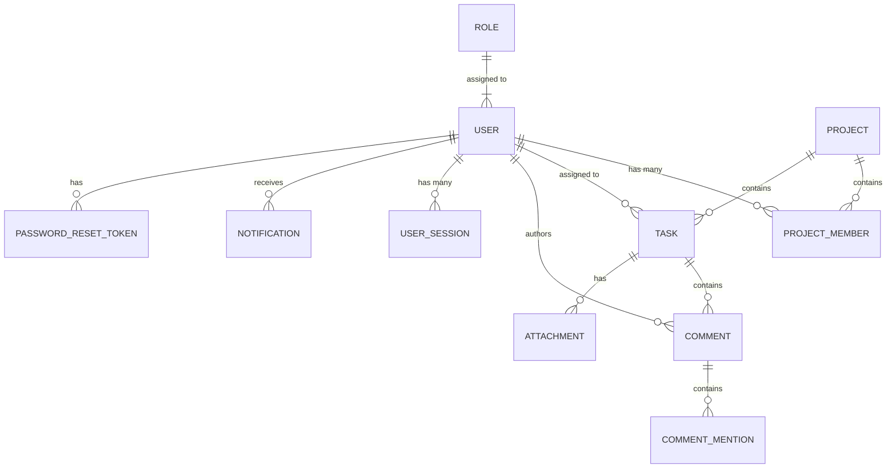

# Database Schema

The database utilizes **PostgreSQL** as the primary datastore, managed and migrated via **Prisma ORM**.

## Entity Relationship Diagram

## Core Entities

1. **Users and Roles**
   - `User`: Primary identity. Contains `passwordHash`, `firstName`, `lastName`, and `accountStatus`.
   - `Role`: Standardized roles (`Admin`, `Manager`, `User`) defining system-wide permissions (stored as a JSON array or simple string tags).
   
2. **Projects**
   - `Project`: A logical container for Tasks. Has a status, timeline, and associated owner.
   - `ProjectMember`: A junction table detailing which user belongs to which project and their localized role (e.g., `Viewer`, `Editor`, `Owner`).

3. **Tasks**
   - `Task`: A unit of work belonging to a Project. Contains `status` (Todo, In Progress, Done), `priority`, `dueDate`, and references an optional `assigneeId`.
   
4. **Collaboration**
   - `Comment`: Text entries left on tasks. Supports mentions.
   - `CommentMention`: Tracks which users were mentioned in which comments to facilitate notification dispatch.
   - `Attachment`: Files uploaded to tasks. Stores MIME type, size, and secure file paths.

5. **Security & Auditing**
   - `UserSession`: Tracks active refresh tokens, IP addresses, and User Agents. Supports remote logout and device invalidation.
   - `AuditLog`: An append-only log of critical mutations in the system (e.g., Task Created, Project Updated).
   - `PasswordResetToken`: Ephemeral tokens used for recovering lost passwords.

## Indexing Strategy

Critical foreign keys and commonly filtered columns are indexed in Prisma (`@@index`):
- `ProjectMember`: Compound unique index on `(projectId, userId)` for fast membership checks.
- `UserSession`: Indexed on `userId` to quickly retrieve sessions during token rotation.
- `Task`: Indexed on `projectId` and `assigneeId` since dashboards heavily aggregate this data.
